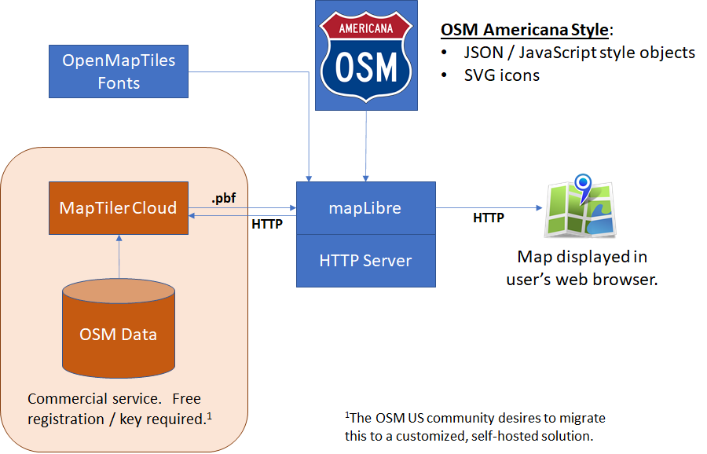

# Contributor's Guide
*Contributors welcome!*

The repository is organized as follows:
* **style/** - The map style.  See [Style Contributor's Guide](style/CONTRIBUTE.md)
* *Coming soon!  Other customized parts of the tech stack.*

Some general guidelines:
* Please follow the coding style guidelines described in each sub-folder.  These guidelines are designed to make it easier for collaboration and reduce the chance of edit conflicts.
* Innovation is encouraged!  Please open a new ticket with your great ideas as a centralized focal point for discussion.
* New contributors are welcome!
* This style operates on the principle of consensus.  Maintainers should ensure that changes represent a broad consensus within the American mapping community.
* Maintainers are also responsible to ensure that this principle of consensus does not cause stagnation or inaction.  Contributor time is valuable; accepting the responsibility of being a maintainer means committing to responding to issues and PRs on a reasonable timeline that encourages community participation.

## Technology Stack

The technology stack for this style can be summarized below:

Some notes:
* This style currently consists of the stylesheets alone, and relies on the MapTiler Cloud service, however, we hope to migrate to a self-hosted vector tile server that would allow us to customize the tiles, integrate other technologies, and optimize the size of served vector tiles.
* SVG icons are converted into a png sprite sheet which is parsed by the mapLibre front-end.
