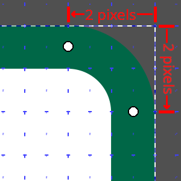
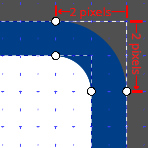
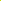

# Americana Style Development

_'murica!_

The style is located within **src/** and is organized as follows:

- **layer/** - Individual style layers, organized by subject area
- **icons/** - SVG icons, which get converted into PNG stylesheets
- **constants/** - Style elements that are frequently re-used
- **js/** - Dynamic javascript code for highway shields and stylesheet building
- **config.js** - Configuration settings (MapTiler API key, OpenMapTiles URL, etc)
- **americana.js** - OpenMapTiles loader with layer ordering
- **index.html** - Demonstration map HTML page

## Install Node.js

Any [currently supported version of Node.js][31] should work. The current LTS
release is recommended. Installation options:

- Download and run the installer from [nodejs.org][52]
- Install via package manager (See [platform specific notes](#platform-specific-notes) below)
- [Use NVM][30] to manage multiple different Node.js versions

## Update NPM

NPM is included with the Node.js install, but as **NPM version 8.3** or newer is required
for this project, you may need to update it. To [update NPM to the latest version][32],
run either of these commands:

```
npm update -g npm
```

```
npm install -g npm@latest
```

It may be necessary to prefix these with `sudo` depending where NPM is installed on your system.

[30]: https://heynode.com/tutorial/install-nodejs-locally-nvm
[31]: https://nodejs.org/en/about/releases/
[32]: https://docs.npmjs.com/try-the-latest-stable-version-of-npm

## Platform Specific Notes

### MacOS

MacOS doesn't include a default package manager, but Node.js and NPM can be installed via
[Homebrew][50] or [MacPorts][51]:

- Homebrew - `brew install node`
- MacPorts - `sudo port install npm8`

#### Apple Silicon/ARM Macs

Running the project natively on an Apple Silicon Mac is not currently possible due to
[dependency issues][62]. However, it is possible to work around this by [running the
project through Rosetta][63].

### Windows

Running the project natively on Windows is not currently possible due to [dependency issues][61].
Instead running on [Ubuntu](#ubuntu-linux) via [Windows Subsystem for Linux][60] is recommended.

### Ubuntu Linux

The Node.js packages in the default Ubuntu repos are generally out of date. Instead, it is
recommended to use the [NodeSource repositories][40] for installing Node.js via APT. You can [choose
a specific version][41], or install the current LTS release:

```
curl -fsSL https://deb.nodesource.com/setup_lts.x | sudo -E bash -
sudo apt install nodejs
```

[40]: https://github.com/nodesource/distributions/blob/master/README.md
[41]: https://github.com/nodesource/distributions/blob/master/README.md#installation-instructions
[50]: https://brew.sh/
[51]: https://www.macports.org/
[52]: https://nodejs.org
[60]: https://docs.microsoft.com/en-us/windows/wsl/install-win10
[61]: https://github.com/ZeLonewolf/openstreetmap-americana/issues/132#issuecomment-1036976993
[62]: https://github.com/ZeLonewolf/openstreetmap-americana/issues/132
[63]: https://github.com/ZeLonewolf/openstreetmap-americana/issues/132#issuecomment-1027274543

## Install Project Level NPM Dependencies

All other dependencies are installed via NPM. Dependencies are listed in the `package.json`,
and `package-lock.json` files. Run this command to install them in the project directory:

`npm install`

### NPM Troubleshooting

If you run into permissions errors with NPM, setting the user with this command may
help: `npm -g config set user $USER`. Issues like this this can usually be avoided by
[not running `npm` with `root` or `sudo`][80]. Another good troubleshooting step is
simply deleting the `node_modules` folder (contains all the installed dependencies)
and re-running `npm install`.

[80]: https://medium.com/@ExplosionPills/dont-use-sudo-with-npm-still-66e609f5f92

## Config File

Environment specific settings go in the untracked file `config.js`. Copy from one of
the templates in the configs/ folder `config.*.js` and rename it `config.js` in
the src/ root. The variables in this file can then be changed without the risk of
accidentally comitting to the main repo.

You can create a new copy of the config file by running `npm run config`

### MapTiler API Key

This project can use vector tiles provided by MapTiler.
For this to work, you must create an account and obtain a free key from
[MapTiler Cloud][20]. This key should be pasted into the `MAPTILER_KEY` variable of
the `config.js` file.

### Custom OpenMapTiles URL

For testing upcoming features of the [OpenMapTiles schema][21] or for fresher data than
MapTiler Cloud provides, a custom vector tile url can be set in the `OPENMAPTILES_URL`
variable of the `config.js` file. However, this requires setting up a custom OpenMapTiles
server which is beyond the scope of this guide.

[20]: https://cloud.maptiler.com/maps/
[21]: https://openmaptiles.org/schema/

## Running the Americana style

### In development...

```
npm install
npm start
```

The simplest way to run the style is to run `npm start`. This will generate the sprite
sheet and launch a simple HTTP server on port 1776 with a document root at the current
location. For a production installation, the .html and .js files, as well as the
generated sprites folder need to be installed on a production web server.

Running `npm run sprites` will re-generate the sprite sheets without needing to
restart the web server.

### Production builds

```
npm install
npm run build
```

These commands will build a minified/bundled version of the Americana demo with
all assets in `dist/`. The contents of `dist/` can then be copied to a webserver
for distribution. A [taginfo project file][taginfo] will also be generated based on the
boilerplate in `scripts/taginfo_template.json`.

[taginfo]: https://wiki.openstreetmap.org/wiki/Taginfo/Projects

## Before submitting a PR

1. Please prettify all files prior to submission. Run `npm run code_format` to
   format code files with [prettier][90] and SVG files with [SVGO][svgo].
2. If you are introducing a novel approach to depicting a layer or feature
   property from the OpenMapTiles schema, document how the corresponding
   OpenStreetMap key or tag is used in `scripts/taginfo_template.json`.

[90]: https://prettier.io/
[svgo]: https://github.com/svg/svgo/

## Highway Shield Contributor's Guide

Highway shields are a key feature of the OpenStreetMap Americana style. This guide describes some of the style principles that contributors of highway shield artwork should consider when submitting new shields. The required elements are as follows:

1. Shields are in .svg format
2. Shields are 20px on the smallest dimension (this will be rasterized to 20px or 40px depending on display resolution)
3. Shields are license-compatible (public domain or CC0)

In addition, the following style guidelines are recommended:

1. Use a 1px stroke size for line elements. Horizontal/vertical lines should be aligned to the pixel grid.
   - In Inkscape, press `Ctrl+Shift+D`, and create a rectangular grid in the "Grids" tab. Set Spacing X and Spacing Y to `0.5`, and Major grid line every `2`. You can turn snapping to the grid on and off by pressing `%`.
2. Complex or intricate graphic elements should be simplified.
3. Background shading should be removed.
4. Route numbers should be large enough to be legible.
5. Shields should consistently use squared or rounded corners, but not a mix of both. Rounded corners should have a 2px radius.
   - To give a rectangle a 2px corner radius, drag the circular handles 2 pixels (4 grid lines) away from the edge, as shown in the following examples:

 

In general, this style is not trying to exactly replicate highway shields as seen on signage. Instead, we are trying to extract the key stylistic elements so that the graphics are recognizable as simplifications of their real-world counterparts. Here are some examples of Americana's simplified shields for small-size readability:

| Network                | Real-world Shield                                                                                          | Americana Representation                                                                                                              |
| ---------------------- | ---------------------------------------------------------------------------------------------------------- | ------------------------------------------------------------------------------------------------------------------------------------- |
| NJ Turnpike            |  |  |
| Washington State Route |                    |             |

More complicated shields may be more challenging to simplify. Consider taking some inspiration from the [rebusurance](https://github.com/1ec5/rebusurance) project, which effectivly simplifies a number of complex state shield designs by stretching, compressing, omitting, or simplifying graphic elements.

### Color Scheme

For consistency, shields should use the following color palette:

| color                                                                 | Pantone | RGB         | Hex triplet |
| --------------------------------------------------------------------- | ------- | ----------- | ----------- |
|  Blue         | 294     | 0 63 135    | #003f87     |
|  Brown        | 469     | 105 63 35   | #693f23     |
|  Green        | 342     | 0 103 71    | #006747     |
|  Orange       | 152     | 243 143 0   | #f38f00     |
|  Pink         | 198     | 223 70 97   | #df4661     |
|  Purple       | 259     | 109 32 119  | #6d2077     |
|  Red          | 187     | 191 32 51   | #bf2033     |
|  Yellow       | 116     | 255 205 0   | #ffcd00     |
|  Yellow-Green | 382     | 196 214 0   | #c4d600     |
|  White              | N/A     | 255 255 255 | #ffffff     |
|  Black              | N/A     | 0 0 0       | #000000     |

Base data from MUTCD Color Specifications, Federal Highway Administration

See the [developer tools](dev/README.md) for an importable, Inkscape-compatible palette file.

### Font Sizes

Shields should target 8-14px text actual-size character heights for readability:

| Example                                                 | Text height |
| ------------------------------------------------------- | ----------- |
|  | 16px        |
|  | 14px        |
|  | 12px        |
|  | 10px        |
|   | 8px         |
|   | 6px         |

It is not possible to use font sizes greater than 14px in shields.

### Shield Definitions

The `loadShields` function in js/shield_defs.js contains a definition object for each shield displayed on the map. A definition object can contain the following properties:

- **`backgroundImage`** – A reference to the image file used as the shield background, based on the name of the file in icons/. To use a different image depending on the length of the inscribed text, specify an array of images.
- **`colorLighten`** – Replace the black portions of the specified background image with this color via a "lighten" operation.
- **`norefImage`** – A reference to an alternative image file used when there is no `ref`. This is appropriate if some routes in the network have a `ref` tag and others do not, and the routes with no ref need a special shield.
- **`notext`** – By default, a relation missing a `ref` tag will not appear as a shield. Set this property to `true` to display a shield even if it has no `ref`. This is appropriate for one-off shield networks, which are common for toll roads and touristic routes.
- **`padding`** – An object that specifies the amount of padding on each side of the inscribed text relative to the background image.
- **`textColor`** – The color of the inscribed text to superimpose on the background.
- **`textLayoutConstraint`** – A strategy for constraining the text within the background image, useful for shields of certain shapes. By default, the text will expand to fill a rectangle bounded by the specified padding while maintaining the same aspect ratio.

Additionally, **`refsByWayName`** is an object mapping way names to text that can be superimposed on the background as a fallback for a missing `ref` value. (`refsByWayName` implies `notext`.) This temporary fallback is designed for use in [limited situations](https://wiki.openstreetmap.org/wiki/United_States/Unusual_highway_networks). In the future, it is expected that these initialisms will be encoded on the server side by processing appropriate tagging which holds the initialism in the database.

`refsByWayName` only works if there is no `ref` tag and the expression in the `routeConcurrency` function in layer/highway_shield.js includes the `name` property in the image name. The network needs to be listed as an input value that causes the `match` expression to append `name` to the image name.

### Banners

The shield definition supports a property **`modifiers`** which accepts an array of text strings which will be drawn atop each shield, in 10px height increments. This is used in cases where additional text is needed to differentiate shields with a common symbology, for example for [special routes of the US Numbered Highway System](https://en.wikipedia.org/wiki/List_of_special_routes_of_the_United_States_Numbered_Highway_System):

<br/>

Banners should be specified in the following cases:

- When a route represents a variant of a main route with which it shares a common shield design. The banner ensures that the variant route information, which is an important component of the route, is visually displayed.
- When two or more routes from different networks share a common symbology in the map within a common geographical area. Shields which are very similar may be drawn using common graphics for simplicity and readability, for example, when the networks differ only by a difference in text. In these cases, the most significant network should be drawn with no banner, and each of the less significant networks should be drawn with a banner.
- When a short text of up to 4 characters is a significant stylistic element of a shield that can't reasonably be incorporated into the main shield graphic for aesthetic reasons.

In all cases, banner text should be no more than **4** characters in length.

### Special Cases

This style strives to draw representative highway shields wherever they are tagged on road route relations consistently with international norms. This style operates on the expectation that the `network` value on a route relation corresponds to the shield design that will be drawn, and the `ref` value will contain the text which is drawn on the shield. In order to give appropriate mapper feedback, this style will add support for special cases only when the complexity of the route network and shield styling cannot be adequately expressed via `network` and `ref` alone. These special cases should be exceptionally rare and documented in the list below. PRs to add special case code should also add an entry below justifying its inclusion. For all other `network` and `ref` combinations, the style will draw a "generic" shield displaying the `ref` value.

- **Arkansas Highway 980**. Highway 980 is a designation applied to various short state highways leading to airports. It has a unique shield based on the state route shield, with a white-on-blue color scheme and additional artwork. Because these roads are clearly part of the Arkansas state highway system designated by `network=US:AR`, special code is needed to apply the special coloring to this route.
- **Georgia State Routes**. Highway shields for Georgia State Routes 515 and 520 are colored in blue and green respectively, rather than the usual black, for their entire length. This is done because these roads are part of the Appalachian Development Highway System. Because these roads are clearly part of the Georgia state highway system designated by `network=US:GA`, special code is needed to apply the special coloring to these two routes.
- **Italy "Diramazione" (branch) motorways**. Between their main autostrade "A" roads, the Italian motorway network has branch motorways which carry the name of both highways that they connect. For example, the A7 and A26 motorways have a branch motorway named A7/A26, which is correctly tagged `ref=A7/A26` and drawn on shields with the two motorway numbers stacked vertically. This requires special code to split ref values at the `/` and draw the two text strings in a stacked configuration.
- **Kentucky Parkways**. Kentucky signs a network of state highways which use a common shield styling, but with full-text names of the parkways on the shields. In addition, these routes are locally known by initialisms. Because these parkways are clearly a common network due to their common shield symbology, special code is needed to convert parkway names to their locally-expected initialisms. Because the initialisms are not present on shields, it would not be appropriate to encode this data in the `ref` tag.
- **Ontario's Queen Elizabeth Way**. The Queen Elizabeth Way has a special shield based on the King's Highway shield, with a blue-on-yellow color scheme. Because this highway is clearly part of the King's Highway designated by `network=CA:ON:primary`, with an unsigned internal designation of 451, special code is needed to apply the special coloring to this route.
- **Pittsburgh Belt System**. Shields for this system use colors, with a colored circle and the words "<COLOR> BELT". These shields are drawn as squares with colored circles, with the `ref` values correctly corresponding to the text on the shield. Because of the common design (white shield with colored circle), these shields are properly part of a common route network. Special code is needed to convert the textual ref values to the colors displayed in the shield.
- **Yukon Routes**. The majority of Yukon Route shields are red, but certain numbered highways have yellow, blue or green shields for their entire length. Because these roads are clearly part of the Yukon system designated by `network=CA:YT`, special code is needed to apply the special coloring to these routes.
