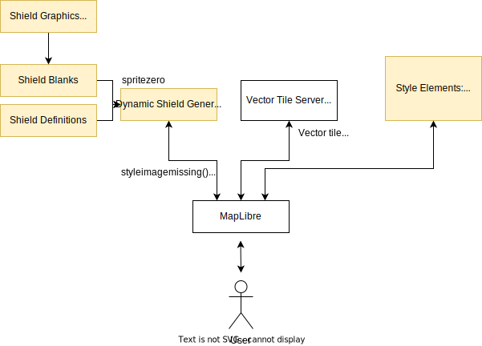
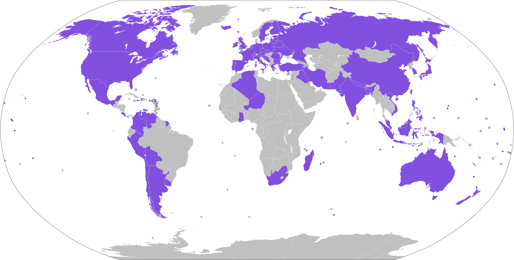

# OpenStreetMap Americana Style

_A quintessentially American map style_ [🗺 View the map](https://zelonewolf.github.io/openstreetmap-americana/)

The purpose of the Americana style is to:

- Promote collaboration and common purpose in the American mapping community
- Express the American experience through cartography, taking inspiration from the familiar features of North American paper maps
- Challenge the status quo by showcasing innovation and invention

The Americana style is the first digital map to achieve concurrent, state-specific highway shields arranged along the path of road. Representative highway shield rendering is of considerable cartographic importance to the American community. We do this proudly in an open source project using vector tile technology.

## Contributor's Guide

_Contributors welcome!_

The repository is organized as follows:

- **src/** - The map style. See [CONTRIBUTING.md](CONTRIBUTING.md).
- **dev/** - Development tools used for style development. See [Style Developer Tools](dev/README.md)
- _Coming soon! Other customized parts of the tech stack._

Some general guidelines:

- Please follow the coding style guidelines described in each sub-folder. These guidelines are designed to make it easier for collaboration and reduce the chance of edit conflicts.
- Innovation is encouraged! Please open a new ticket with your great ideas as a centralized focal point for discussion.
- New contributors are welcome!
- This style operates on the principle of consensus. Maintainers should ensure that changes represent a broad consensus within the American mapping community.
- Maintainers are also responsible to ensure that this principle of consensus does not cause stagnation or inaction. Contributor time is valuable; accepting the responsibility of being a maintainer means committing to responding to issues and PRs on a reasonable timeline that encourages community participation.

## Technology Stack

The technology stack for this style can be summarized below:

## Coverage

Americana is compatible with vector tiles covering the entire world.

Americana displays custom route shields for routes in the following U.S. states:

and for routes in the following countries:

We are hoping that it will support more areas, you can [help us](style/CONTRIBUTE.md)!
